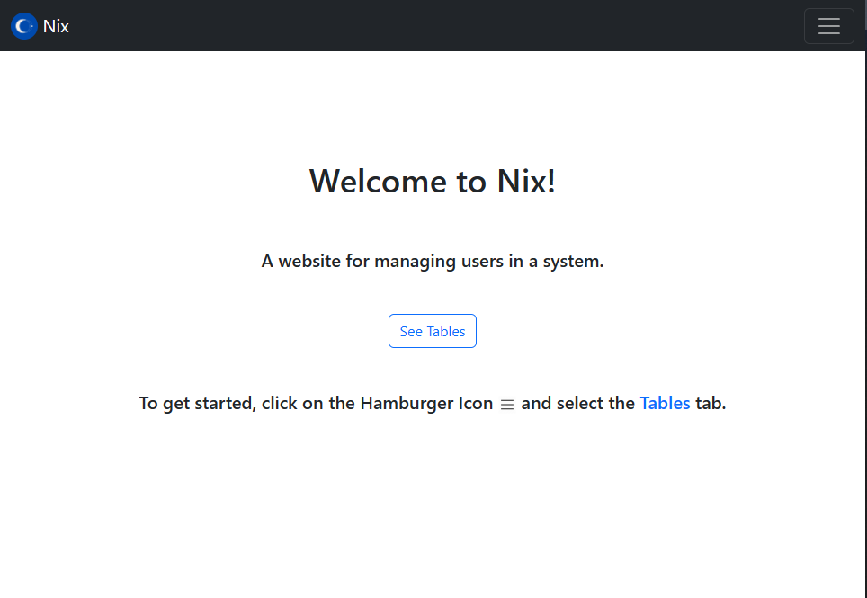
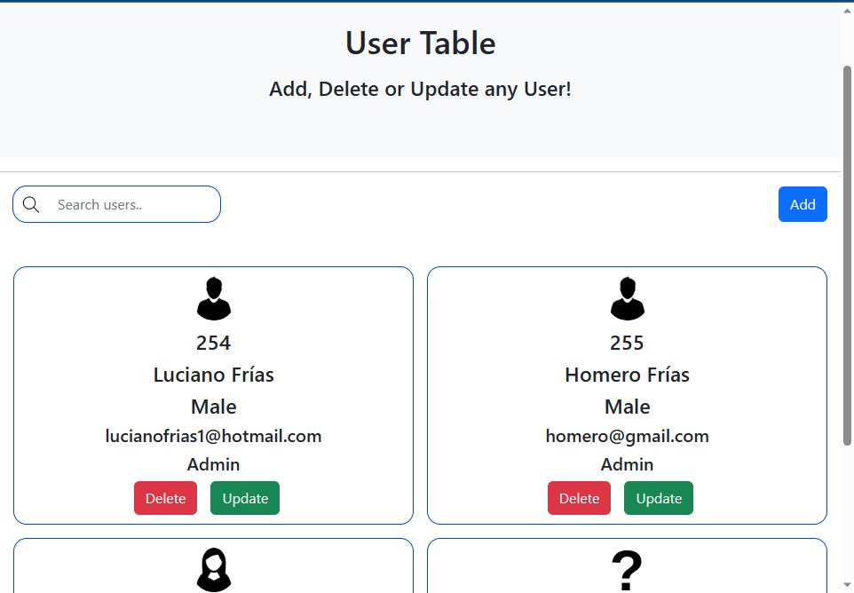

# nix-user-manager-node

### This is a previously made user manager named Nix, but this time, it was remade using NodeJS (JavaScript) instead of Spring Boot (Java).

Hello! Welcome to Nix. This is an User Management System. You can add, delete or update users as much as you like.

# Preview

### Home Page

### Tables Page

# Changes from Spring Boot Version

This version of the project has much needed enhanced features such as password encryption and environment variables to increase security.

It was built with NodeJS this time around and still utilizes the Clean Architecture design.

This is mainly a backend-focused project.

# Used Tools

This project was mainly built with:
1. Backend
    - JavaScript
    - NodeJS
    - ExpressJS

2. Frontend
    - HTML
    - CSS
    - JavaScript
    - Bootstrap

3. Database
    - MySQL

# How to run the project
1. Make sure to have NodeJS and MySQL installed in your computer

2. Download the project

3. Create a file named ".env" without the quotes in the root folder.

4. Inside the file, put this:
    - PORT=3000
    - MYSQL_HOST={YOUR_HOST}
    - MYSQL_USER={YOUR_USER}
    - MYSQL_PASSWORD={YOUR_PASSWORD}
    - MYSQL_DATABASE={YOUR_DATABASE}
    - MYSQL_PORT={YOUR_PORT}
    
5. After that, save and close the project.

6. Open up a terminal in the root folder and run:
- npm install bcrypt dotenv express jsonwebtoken mysql mysql2 path request

7. Finally, run "npm start" in your terminal, and you can start working on the project!

